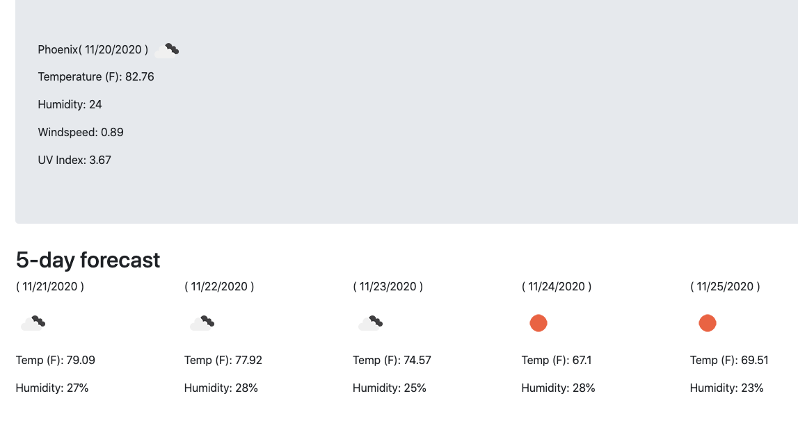
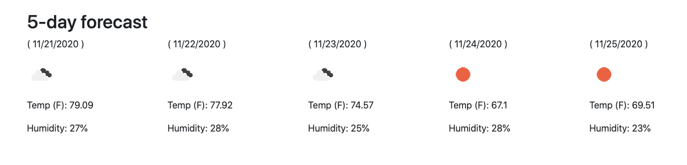
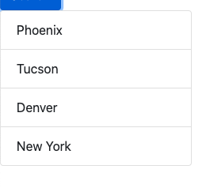

# code-weather
Here I built a weather app that is able to display the temperature (F), the humidity, the windspeed, and the UV index for the searched city.

The user is also presented with a 5 day forecast for the searched city.

Searched cities are stored locally for later recall

Link to weather app: https://eriklowrance.github.io/code-weather/